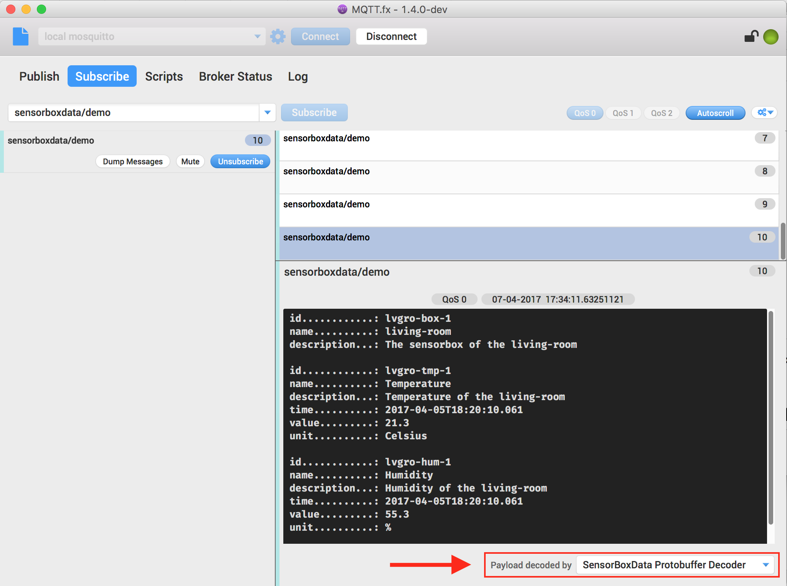

# SensorBox Data Decoder

This SensorBox Data Decoder implementation is dedicated to be used as custom payload decoder add-on in
[MQTT.fx](http://mqttfx.org).

See also: [addon-commons](https://github.com/Jerady/addon-commons) and [mqttfx-payload-decoders](https://github.com/Jerady/mqttfx-payload-decoders).

## Protocol Buffers

The SensorBox Data Decoder decodes [Google Protocol Buffers](https://developers.google.com/protocol-buffers/)
 encoded payload based on `proto/sensorboxdata.proto`

```
syntax = "proto3";
package sensorboxdata;

option java_package = "de.jensd.proto";
option java_outer_classname = "SensorBoxData";

message SensorData {
    string id = 1;
    string name = 2;
    string description = 3;
    uint64 time  = 4;
    double value = 5;
    string unit = 6;
}

message SensorBoxData {
    string id = 1;
    string name = 2;
    string description = 3;
    repeated SensorData sensorData = 4;
}
```

Decoded payload looks like this in human readable format:

```
id............: lvgro-box-1
name..........: living-room
description...: The sensorbox of the living-room

id............: lvgro-tmp-1
name..........: Temperature
description...: Temperature of the living-room
time..........: 2017-04-05T18:20:10.061
value.........: 21.3
unit..........: Celsius

id............: lvgro-hum-1
name..........: Humidity
description...: Humidity of the living-room
time..........: 2017-04-05T18:20:10.061
value.........: 55.3
unit..........: %
```


This project includes the [sbt-protoc](https://github.com/thesamet/sbt-protoc) plugin.
The proto case classes are created at `../target/scala-2.11/src_managed/main`.


## Create add-on package for MQTT.fx >=1.4.0

`sbt assembly`
 
creates a FatJar at

`../target/scala-2.11/sensorbox-data-decoder-assembly-1.0.jar`

Copy this package into the `"addons"` directory of MQTT.fx:

| OS        | Add-on location          |
|---|---|
|**Mac OSX**|`[USER_HOME]/Library/Application Support/MQTT-FX/addons`|
|**Windows**|`[USER_HOME]\AppData\Local\MQTT-FX\addons`|
|**Linux**|`[USER_HOME]/MQTT-FX/addons`|

MQTT.fx will find the Decoder during next start.
Have a look at About / Add-ons to verfigy MQTT.fx has loaded the decoder:


## Publish demo MQTT messages

`sbt run`

Runs a Publisher to publish 10 MQTT messages with sensorboxdata.proto encoded payload.
A per default it connects to Broker URL `tcp://localhost:1883`. Messages are published to topic `sensorboxdata/demo`:


```bash

----------------------------------------------------------------------
 Publishing 10 MQTT messages with sensorboxdata.proto encoded payload
----------------------------------------------------------------------

Topic ........ : sensorboxdata/demo
Broker URL ... : tcp://localhost:1883
     

[START]
Connecting to tcp://localhost:1883... OK

Message #1 published to sensorboxdata/demo
Message #2 published to sensorboxdata/demo
Message #3 published to sensorboxdata/demo
Message #4 published to sensorboxdata/demo
Message #5 published to sensorboxdata/demo
Message #6 published to sensorboxdata/demo
Message #7 published to sensorboxdata/demo
Message #8 published to sensorboxdata/demo
Message #9 published to sensorboxdata/demo
Message #10 published to sensorboxdata/demoDisconnected
[DONE]
```
Meanwhile at MQTT.fx... note the choosen payload decoder at the bottom:



To connect to a specific broker pass `<name>/<ip>:<port>` to the `'run'` task: 

`sbt "run 192.168.0.61:1883"`

Additionally you can set a certain topic as 2nd argument:

`sbt "run 192.168.0.61:1883 proto/demo"`

